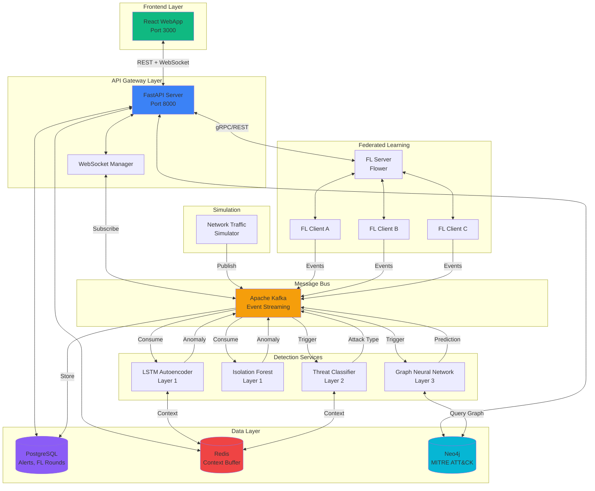
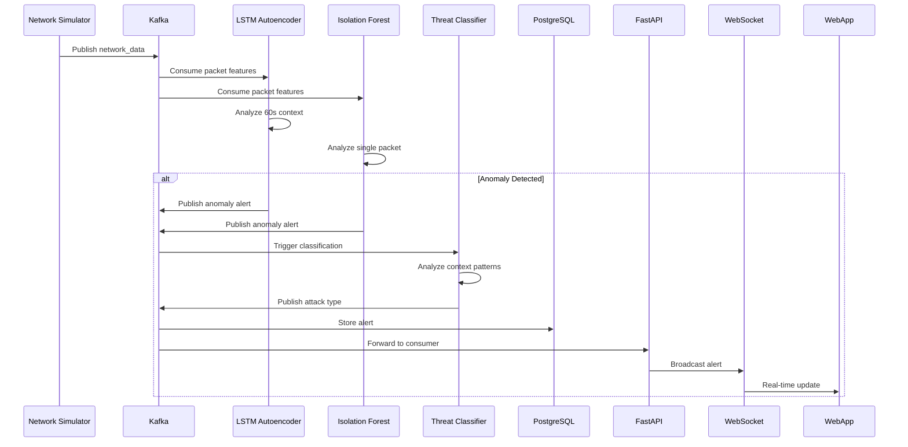
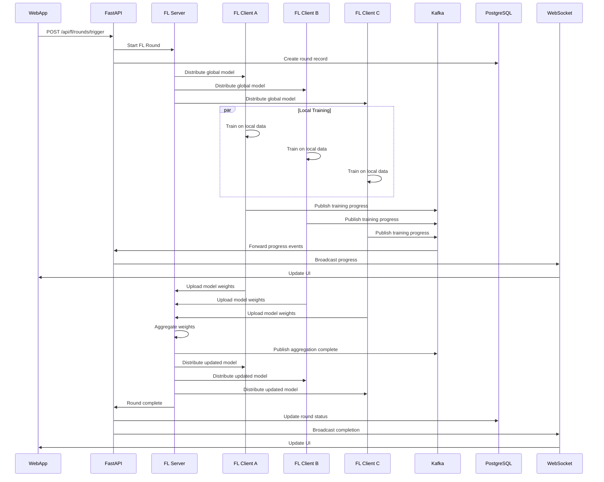
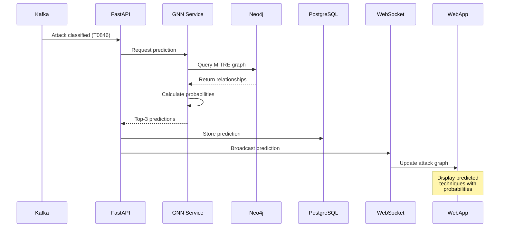
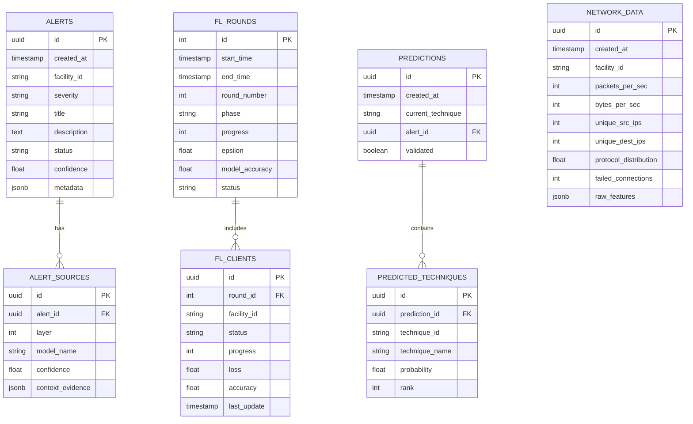
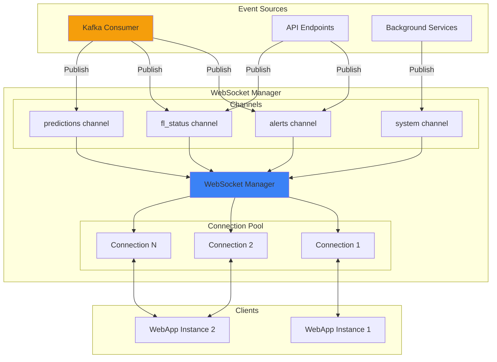
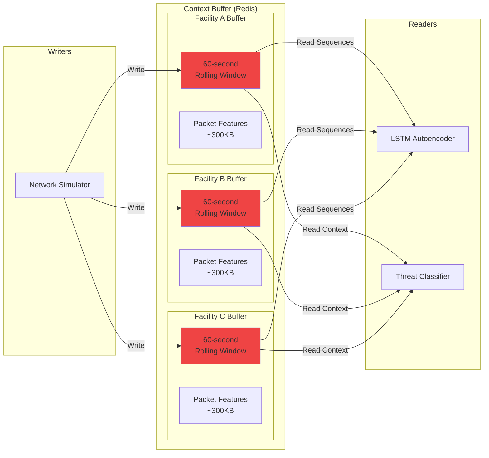
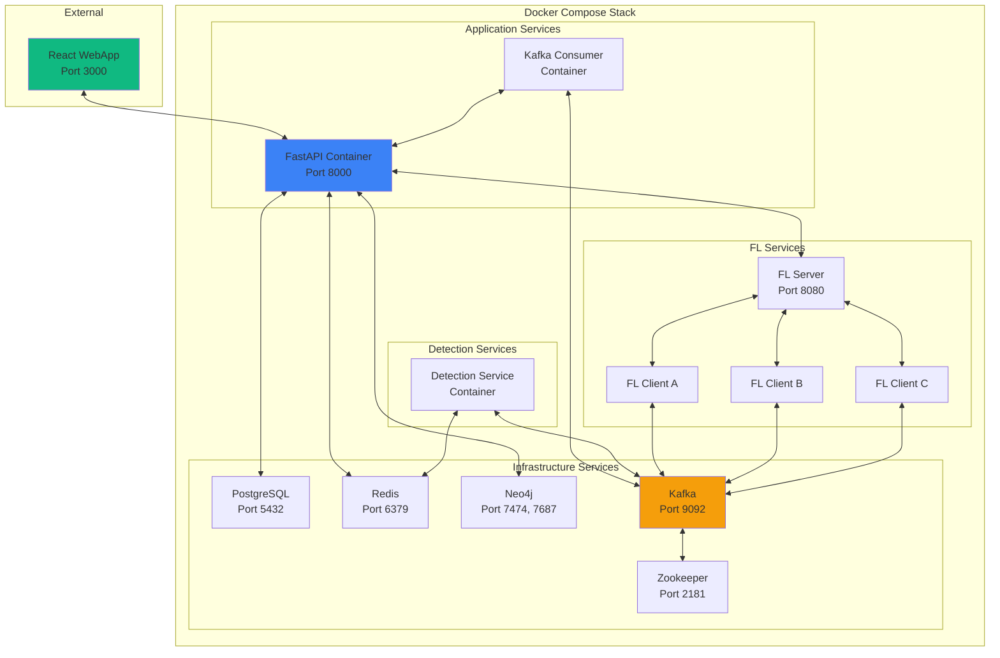
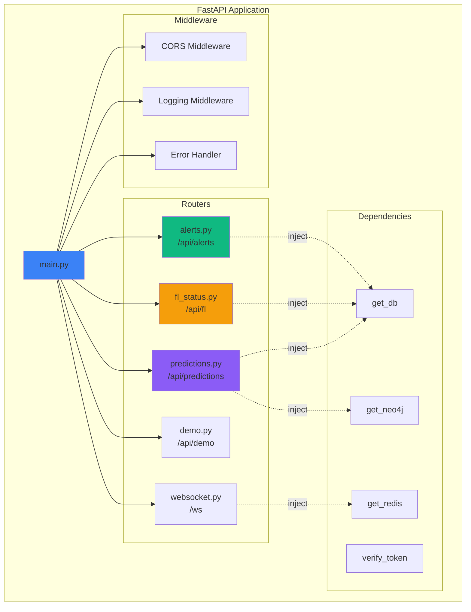

# Backend Architecture

## System Overview



## Detailed Component Architecture

```mermaid
graph TB
    subgraph "FastAPI Application Structure"
        Main[main.py<br/>Application Entry]
        
        subgraph "API Routes"
            AlertsAPI[/api/alerts]
            FLAPI[/api/fl]
            PredAPI[/api/predictions]
            DemoAPI[/api/demo]
            HealthAPI[/health]
        end
        
        subgraph "Services"
            KafkaConsumer[Kafka Consumer<br/>Bridge]
            WSManager[WebSocket Manager<br/>Pub/Sub]
            ContextBuffer[Context Buffer<br/>Service]
            FLService[FL Service<br/>Wrapper]
        end
        
        subgraph "Data Access"
            AlertsDB[Alerts Repository]
            FLDB[FL Rounds Repository]
            PredDB[Predictions Repository]
            GraphDB[Graph Repository]
        end
        
        subgraph "Models & Schemas"
            SQLModels[SQLAlchemy Models]
            Pydantic[Pydantic Schemas]
        end
        
        Main --> AlertsAPI
        Main --> FLAPI
        Main --> PredAPI
        Main --> DemoAPI
        Main --> HealthAPI
        
        AlertsAPI --> AlertsDB
        FLAPI --> FLDB
        PredAPI --> PredDB
        PredAPI --> GraphDB
        
        AlertsAPI --> WSManager
        FLAPI --> WSManager
        PredAPI --> WSManager
        
        KafkaConsumer --> WSManager
        KafkaConsumer --> AlertsDB
        
        AlertsDB --> SQLModels
        FLDB --> SQLModels
        PredDB --> SQLModels
        
        AlertsAPI --> Pydantic
        FLAPI --> Pydantic
        PredAPI --> Pydantic
        
        ContextBuffer --> Redis[(Redis)]
        AlertsDB --> PG[(PostgreSQL)]
        GraphDB --> Neo4j[(Neo4j)]
    end

    style Main fill:#3b82f6
    style KafkaConsumer fill:#f59e0b
    style WSManager fill:#10b981
```

## Data Flow Diagrams

### Alert Detection Flow



### Federated Learning Round Flow



### Attack Prediction Flow



## Database Schema



## WebSocket Architecture



## Context Buffer Architecture



## Deployment Architecture



## API Layer Structure



---

**Document Version:** 1.0  
**Last Updated:** November 10, 2025  
**Status:** Architecture Documentation
